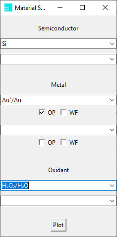
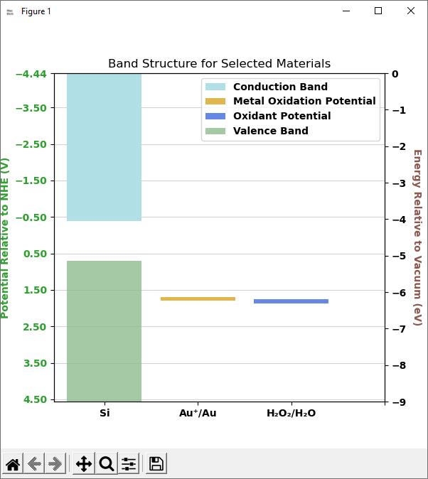

# MacEtchBandAlign: Semiconductor & Catalyst Band Alignment Visualizer

**MacEtchBandAlign** is a cross-platform desktop application for plotting valence bands, conduction bands, work functions, and oxidation potentials of semiconductors and catalyst materials.

It includes a simple GUI, customizable material entry, and dynamic plotting of selected materials.

---

## 🧰 Features

- Visualize semiconductor and metal energy levels relative to NHE and vacuum
- Enable/disable plotting of work function or oxidation potential per material
- Add custom semiconductors, metals, and oxidants from the GUI
- Supports Windows, macOS, and Linux (coming soon!) binaries

---

## Screenshots




---

## 📦 Precompiled Binaries

You can use MacEtch without installing Python by downloading the appropriate file below:

| Platform | File                     | Instructions             |
|----------|--------------------------|---------------------------|
| ❖ Windows | `MacEtch.exe`              | Double-click to run       |
| 🍎 macOS   | `MacEtch.app`              | Right-click → Open (first launch) |
| 🐧 Linux  | `MacEtch` (ELF binary)     | Run `chmod +x MacEtch` then `./MacEtch` in terminal | (coming soon)

> ⚠️ On macOS, you may need to allow the app through security settings (`System Preferences → Security & Privacy → Open Anyway`).

---

## 🛠️ Building from Source

### Prerequisites

- Python 3.8+
- `matplotlib`
- `tkinter` (included with Python)
- `numpy`, `pandas`

Install dependencies:

```bash
pip install matplotlib pandas numpy
```
## Run
```bash
python macetch.py
```
## License
This project is licensed under the MIT License - see the LICENSE file for details.
## Author 
Sami Znati
## Disclaimer
This readme was generated with AI

